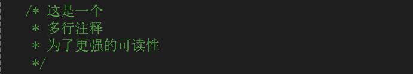

# 资料

* [C#官方文档](https://learn.microsoft.com/zh-cn/dotnet/csharp/tour-of-csharp/#code-try-0)


# 基础概念

## .Net 和 C#关系

* `.Net Framework`是一个平台，<b style="color:red">它提供了可以使用多种编程语言进行统一编程的环境</b>
* 而`C#`则是`.Net Framework`平台上使用量最多的编程语言，除此之外，还可以使用`Python`，`J#`这些等等


# 注意事项

1. <b style="color:blue">类名可以和文件名不同</b>，这点与`Java`不同
2. <b style="color:blue">方法名遵从大驼峰命名法，也就是首字母要大写</b>
3. `C#`是大小写敏感的
4. 与`Java`同理，定义类的时候默认给你一个无参构造方法，但是当你自定义任意构造方法后，编译器就不会默认给你产生无参构造方法
5. 整数/整数还是等于整数


# 使用事项

1. 字符串定义有两种方式

   * `String a = "C:\\adkfja"`：正常定义
   * `String b = @"C:\\dakjfal"`：叫**逐字字符串**，<b style="color:blue">"它会把转义字符`\`当作普通字符对待</b>

   


# 1. 入门

## 基本结构

* //TODO:画图


### - 启动入口


#### · `Main`方法

* `C#`应用程序的入口点在`Main`方法处（<b style="color:blue">库和服务不要求</b>）

  ```c#
  static void Main(string[] args)
  {
      // 启动入口
  }
  ```

* **如果多个类中都有定义`Main`方法，则必须使用`StartupObject`编译器选择来编译程序，用来指定哪个类中的`Main`方法才是真正的入口点**

  ```xml
  <StartupObject>MyNamespace.Program</StartupObject>
  ```

  或

  ```xml
  <MainEntryPoint>MyNamespace.Program</MainEntryPoint>
  ```

  * <b style="color:red">指定的类名必须是完全限定类名(也就是先指定命名空间，后跟类名)--不能用于包含顶级语句的项目</b>

* 官方对其概述(??？返回类型不太懂)

  > 


#### · 顶级语句 ???-莫得实践

* 实际上，**在`C# 9`中添加了可以使用顶级语句作为程序入口点的功能**

  ```c#
  using System;
  
  // 入口点
  Console.WriteLine("Hello world!");
  
  namespace MyNamespace
  {
      class ClassA
      {
      }
  }
  ```

* 注意事项：

  * 由于**入口点具有唯一性**，因此使用顶级语句这种方式作为入口点的话，那么<b style="color:red">包含顶级语句的文件也必须有且只有一个</b>,否则当存在多个顶级文件时会报<u>*错误*</u>`CS802: 只有一个编译单元可具有顶级语句`

  * 在使用了顶级语句这种方式作为入口点后，**可以存在`Main`方法，但自动会忽略使用`Main`作为入口点的选择，编译器会发生如下<u>*警告*</u>`CS7022: 程序的入口点是全局代码; 忽略"Main()"入口点`，特别得禁止强制在编译器选项中来选择入口点**

  * `using`语句是处于位置最上方的，随后才接着顶级语句，顶级语句后面还可以跟命名空间和类型定义

    


//TODO: 未实践


### 标识符命名规则

//TODO:贴图

### 关键字选取

//TODO:贴图

* 类型分类

### 注释

* 单行注释：`// 这是单行注释`

* 多行注释：`/*则是多`

  ​				`行注释*/`

  > **通常为了更强的可读性，会在首尾注释符与内容之间隔一个空格，夹在中间的行都以`*`开头**
  >
  > 


## 数据类型

### - 值类型

//TODO:贴图

// 描述有符号和五符合的区别 （以byte为例，还得画图）

// sizeof()方法获取某个类型所占字节数（例子）


### - 引用类型


#### · 对象类型


#### · 动态类型


#### · 字符串类型


* 逐字字符串


### 


## 类型转换


#### · 隐式转换


#### · 显示转换


#### · 常见的类型转换方法


# 暂时疑问

* 无符号整型`ulong`,`uint`,`ushort`,那为啥最后有一个不叫`ubyte`
* 动态类型具体使用环境

* string和String区别

* C#中接口和抽象类的区别
* 元组具体使用环境