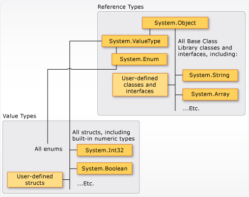

# 资料

* [C#官方文档](https://learn.microsoft.com/zh-cn/dotnet/csharp/tour-of-csharp/#code-try-0)


# 基础概念

## .Net 和 C#关系

* `.Net Framework`是一个平台，<b style="color:red">它提供了可以使用多种编程语言进行统一编程的环境</b>
* 而`C#`则是`.Net Framework`平台上使用量最多的编程语言，除此之外，还可以使用`Python`，`J#`这些等等


# 注意事项

1. <b style="color:blue">类名可以和文件名不同</b>，这点与`Java`不同
2. <b style="color:blue">方法名遵从大驼峰命名法，也就是首字母要大写</b>
3. `C#`是大小写敏感的
4. 与`Java`同理，定义类的时候默认给你一个无参构造方法，但是当你自定义任意构造方法后，编译器就不会默认给你产生无参构造方法
5. 整数/整数还是等于整数


# 使用事项

1. 字符串定义有两种方式

   * `String a = "C:\\adkfja"`：正常定义
   * `String b = @"C:\\dakjfal"`：叫**逐字字符串**，<b style="color:blue">"它会把转义字符`\`当作普通字符对待</b>

   


# 1. 入门

## 基本结构

* //TODO:画图


### - 启动入口


#### · `Main`方法

* `C#`应用程序的入口点在`Main`方法处（<b style="color:blue">库和服务不要求</b>）

  ```c#
  static void Main(string[] args)
  {
      // 启动入口
  }
  ```

* **如果多个类中都有定义`Main`方法，则必须使用`StartupObject`编译器选择来编译程序，用来指定哪个类中的`Main`方法才是真正的入口点**

  ```xml
  <StartupObject>MyNamespace.Program</StartupObject>
  ```

  或

  ```xml
  <MainEntryPoint>MyNamespace.Program</MainEntryPoint>
  ```

  * <b style="color:red">指定的类名必须是完全限定类名(也就是先指定命名空间，后跟类名)--不能用于包含顶级语句的项目</b>

* 官方对其概述(??？返回类型不太懂)

  > 


***


#### · 顶级语句 ???-莫得实践

* 实际上，**在`C# 9`中添加了可以使用顶级语句作为程序入口点的功能**

  ```c#
  using System;
  
  // 入口点
  Console.WriteLine("Hello world!");
  
  namespace MyNamespace
  {
      class ClassA
      {
      }
  }
  ```

* 注意事项：

  * 由于**入口点具有唯一性**，因此使用顶级语句这种方式作为入口点的话，那么<b style="color:red">包含顶级语句的文件也必须有且只有一个</b>,否则当存在多个顶级文件时会报<u>*错误*</u>`CS802: 只有一个编译单元可具有顶级语句`

  * 在使用了顶级语句这种方式作为入口点后，**可以存在`Main`方法，但自动会忽略使用`Main`作为入口点的选择，且编译器会发生如下<u>*警告*</u>`CS7022: 程序的入口点是全局代码; 忽略"Main()"入口点`，特别得禁止强制在编译器选项中来选择入口点**

  * `using`语句是处于位置最上方的，随后才接着顶级语句，顶级语句后面还可以跟命名空间和类型定义

    
  
  * 可以使用`args`变量来引用输入的任何命令行参数（**`args`变量永远不会为`null`，但其`Length`可能为0**）


//TODO: 未实践


***


### 标识符命名规则

//TODO:贴图

### 关键字选取

//TODO:贴图

* 类型分类

### 注释

* 单行注释：`// 这是单行注释`

* 多行注释：`/*则是多`

  ​				`行注释*/`

  > **通常为了更强的可读性，会在首尾注释符与内容之间隔一个空格，夹在中间的行都以`*`开头**
  >
  > 


## 数据类型

* `c#`的数据类型分为两种

  * <b style="color:green">值类型</b>：**其变量直接包含它们的数据，每个变量都有自己的数据副本，因此，对一个变量的执行运算不会影响到另一个变量(`ref`和`out`参数变量除外)**

    ```C#
    using System;
    //官方示例
    public struct MutablePoint
    {
        public int X;
        public int Y;
    
        public MutablePoint(int x, int y) => (X, Y) = (x, y);
    
        public override string ToString() => $"({X}, {Y})";
    }
    public class Program
    {
        public static void Main()
        {
            var p1 = new MutablePoint(1, 2);
            var p2 = p1;
            p2.Y = 200;
            Console.WriteLine($"{nameof(p1)} after {nameof(p2)} is modified: {p1}");
            Console.WriteLine($"{nameof(p2)}: {p2}");
            MutateAndDisplay(p2);
            Console.WriteLine($"{nameof(p2)} after passing to a method: {p2}");
        }
        private static void MutateAndDisplay(MutablePoint p)
        {
            p.X = 100;
            Console.WriteLine($"Point mutated in a method: {p}");
        }
    }
    // Expected output:
    // p1 after p2 is modified: (1, 2)
    // p2: (1, 200)
    // Point mutated in a method: (100, 200)
    // p2 after passing to a method: (1, 200)
    ```

    

  * <b style="color:green">引用类型</b>：**其变量存储的是对应数据所占内存地址的引用**。

* 下图是官方给出的继承链关系图

  


***

### - 值类型

* 值类型派生自`System.ValueTypes（派生自System.Ojbect）`
* **值类型变量直接包含其值**，并且<b style="color:red">对于值类型变量，没有单独的堆分配或垃圾回收开销</b>
* 实际上值类型可以根据其**定义的方式**来分成两类
  * `struct`：格式为 `struct S {...}` 
  * `enum`：`enum E {...}` 

* 官方对`C#`的值类型的进一步划分是分为：简单类型，枚举类型，结构类型，可以为`null`值得值类型和元组值类型


***

#### · 简单类型

* 这个简单类型也叫**内置值类型**，相当于`C#`内部已经提前定义好的值类型，如下图所示

  

* 特别要提一点的是`C#`对于整型又把它分成了有符号整型和无符号整型

   * <b style="color:blue">有符号整型和无符号整型区别在于存储区域的首位二进制码是否表示正负</b>.，因此它们两个能够存储的数值区间范围也是不一样的
  
   * 以`byte`为例，`byte`占一个字节大小，也就是8位
  
   * 对于`byte`，其最大值为：

     
   
   * 对于`sbyte`，其最大值为
   
     
   
     


// sizeof()方法获取某个类型所占字节数（例子）


#### · 枚举类型


#### · 结构类型


#### · 可以为`null`的值类型


#### · 元组值类型???


### - 引用类型

* 创建类型的对象后，其**变量仅保留对相应内存的引用**，若将对象引用分配给新变量后，新变量会引用原始对象。通过一个变量所做的更改将会反映在另外一个变量中，因为它们引用相同的数据。

  


#### · 对象类型


#### · 动态类型


#### · 字符串类型


* 逐字字符串


### 


## 类型转换


#### · 隐式转换


#### · 显示转换


#### · 常见的类型转换方法


# 暂时疑问

* 无符号整型`ulong`,`uint`,`ushort`,那为啥最后有一个不叫`ubyte`
* 动态类型具体使用环境
* string和String区别
* C#中接口和抽象类的区别
* 元组具体使用环境
* sync  await????
* 