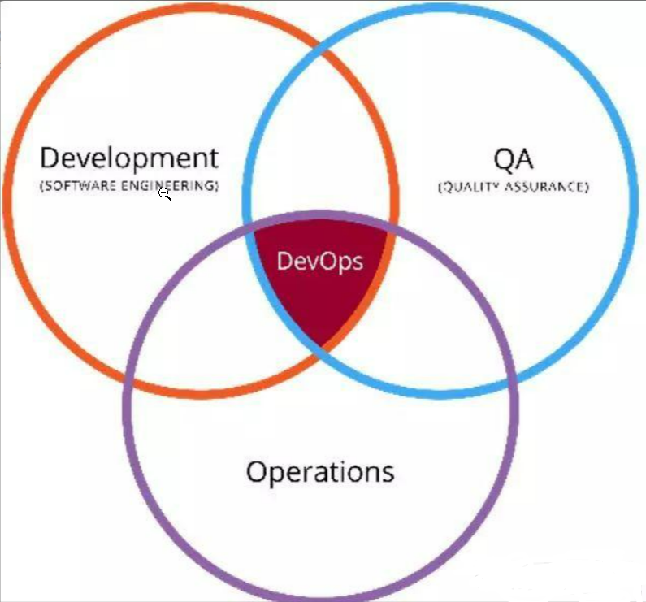
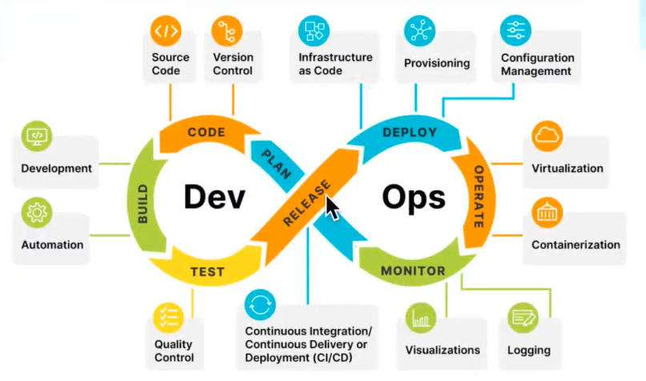
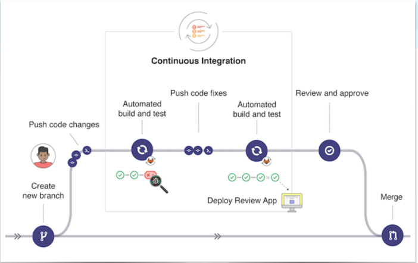

# 关于DevOps的一丢入门

## 基础概念

* `Dev`指`Development`-开发，`Ops`指`Operations`-运维

* 简单来说`DevOps`的含义就是**打通开发运维之间的的壁垒，通过自动化持续集成，迭代，交付，实现开发运维一体化**

* 特别要说明的一点就是，实际上在`Dev`和`Ops`之间，中间还有个环节`test`

  

* <b style="color:red">也就是说`DevOps`的理念是希望做到软件产品交付过程中IT工具链的打通</b>

  

## CI/CD

* `DevOps`的核心就是要借助于`Automation`，而它则是由`CI/CD`来支撑的

### CI

* `CI`是`Continous integration`(持续集成)的缩写

* 其概念简单来说的呢，就是<b style="color:red">每次当代码变动提交合并后，都会借助自动化基于之前已经提前定义布置好的流程进行构建操作。</b>>

  

* **`CI`是要能够自测代码的，用来保证它能够正常工作**
* 实现`CI`的工具很多，比较出名的就是`Jenkins`

### CD

* `CD`-`Continuous delivery/deployment`（持续交付/部署）
  * **持续交付：作为持续集成的扩展，持续将代码更改到部署到不同的环境中**
  * **持续部署：比持续交付更近一步，持续将代码更改部署到生产环境**

* 个人想法，**总觉得它充当着一个管理配置中心的监听者角色，当监听到上一步的代码变动之后，则将其更新到由它管理着的多个配置文件的不同环境中**，相比于传统开发模式下，每次代码变更，都需要人员手动去部署，主打的就是一个`Automation`特性

## 特点

* 优势
  * 对于开发人员：
    * 减少与运维人员的频繁沟通成本
    * `focus on`开发上
  * 对于项目组：
    * 精化整个项目组人员，可以把多余的人员资源放到其他项目上(高利用)
    * 减轻大量人员所带来的沟通成本以及人员本身可能所导致的一些额外问题(不可能谁都不犯错，也不可能谁24小时都处于精力满满的状态)
    * 基于`DevOps`的敏捷开发特性，能够让项目达到一个快速开发迭代的效果，迅速型响应用户反馈

## 一些其他

* 结合了下之前在小公司呆着的经历
* 发现它们喜欢的是比较老的技术选型
* 比如说`Java`层面就特别中意可以用到天荒地老的`JDK 8`，前端框架就是老一代的`lay ui`
* 整体的开发模式都是很传统性的瀑布模型，基本没听过说要选取新的架构，新的技术选型
* 不可否认采取这些比较"稳重"型的东西，对于小公司来说其实也是挺合适的，毕竟对于整个环境而言，采用这些意味着当出现问题时网上有大量的资料方案可查，对于公司招聘人员来说这些相当于必备学会的技术，易于招聘等等
* 但这只能让它们"活着"，想要发展却很难
* 正所谓物以稀为贵，你能做的其他公司也可以做，拿不出点特色的东西出来很难打动别人
* <b style="color:red">处于金字塔模型底部的，如果不去`change`提升，结果要不原地不动，要不`out`</b>
* `change`不管对于公司，还是对于底下的人员来说，确实是痛苦的，但不可否认的是，只有`change`，成长，发展才是有可能的
* 特别是对于我们这些开发人员来说，新的技术选型无时不刻在冒出来，技术迭代也在持续更新，只拥抱老一套的东西，路是走不了多远的

* 故事仍在继续，成长正在路上。